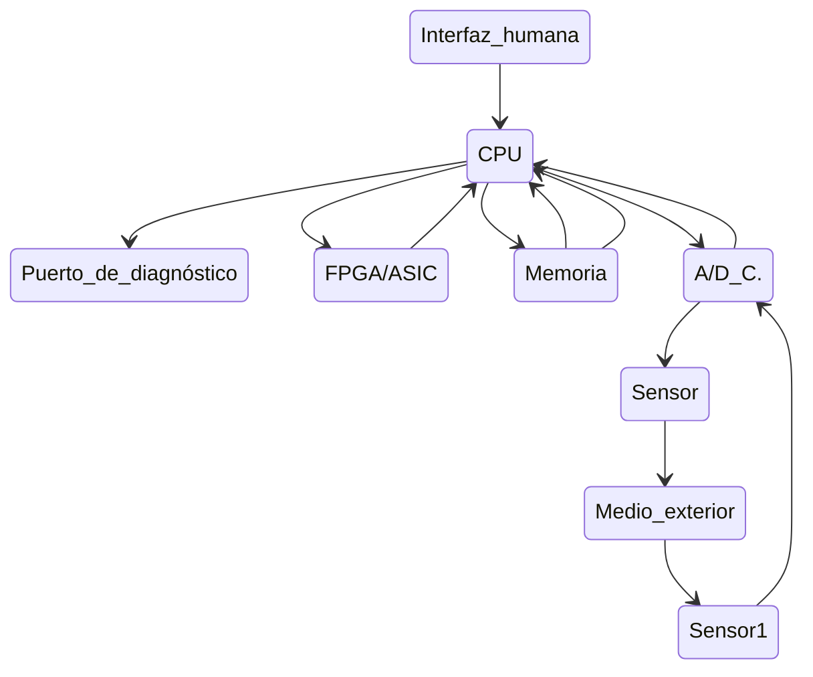

# 405ssedm

 

### Software para Sistemas Empotrados y Dispositivos Móviles(嵌入式和移动设备软件)

### Actividad#1

#### Tema 1: "Introducción a los Sistemas Empotrados y Dispositivos Móviles"

#### Conferencia 1: "Introducción a los Software para Sistemas Empotrados.
Conceptos básicos"

---

#### Introducción

> Los sistemas embebidos (o  empotrados) son sistemas computacionales diseñados para realizar una o  varias funciones específicas dentro de un sistema más grande, sin ser  percibidos como un ordenador convencional. A diferencia de los sistemas  de propósito general, combinan hardware y software de forma que el  algoritmo que define su comportamiento suele ser fijo y no modificable  por el usuario. Su arquitectura típica es heterogénea, integrando  componentes como microcontroladores, procesadores de señal digital (DSP) y circuitos integrados de aplicación específica (ASIC), lo que implica  una decisión crítica de diseño sobre qué funcionalidades se implementarán por hardware y cuáles por software.
>
> Estos sistemas se caracterizan por su concurrencia, fiabilidad, interacción con dispositivos físicos a través de interfaces no convencionales,  robustez para operar en entornos hostiles, bajo consumo y reducido coste y tamaño. Su aplicación es omnipresente en la vida cotidiana, abarcando desde electrodomésticos y sistemas de entretenimiento hasta  dispositivos de comunicación, automoción y control industrial. Esto los  sitúa como la forma de computación más numerosa y extendida, a menudo operando autonómicamente y sin intervención humana directa.

---

#### Objetivo

> Caracterizar los principales elementos, funciones y aplicaciones de los sistemas empotrados.

---

#### ¿Qué son los sistemas empotrados o embebidos (SE)?

> Un sistema empotrado es **un sistema que usa un computador para realizar una función específica**, pero ni es usado ni es percibido como un computador.  Los distinguen las siguientes características:
>- Tienen una funcionalidad de hardware y/o software más limitada que una computadora personal (PC). En términos de limitaciones de hardware, esto puede significar limitaciones en el rendimiento del procesamiento, el consumo de energía, la memoria, la funcionalidad del hardware, etc. En el caso del software, esto generalmente significa limitaciones tales como: menos aplicaciones, aplicaciones de menor escala, ausencia de sistema operativo (SO) o un SO limitado, o código con menor nivel de abstracción. 
>- Está diseñado para realizar una función dedicada. La mayoría de los dispositivos embebidos están diseñados principalmente para una función específica. Sin embargo, ahora vemos dispositivos como los híbridos de asistentes personales de datos (PDA) y teléfonos celulares, que son sistemas embebidos diseñados para realizar diversas funciones principales.
>- Es un sistema de cómputo con mayores requisitos de calidad y fiabilidad que otros tipos de sistemas informáticos. Algunas familias de dispositivos integrados tienen un umbral muy alto de requisitos de calidad y fiabilidad.

---

#### Arquitectura común de un SE

---

### Algunas diferencias con un sistema computador pueden ser las siguientes:

> - La interfaz humana (que en un sistema computador es generalmente la pantalla y el teclado) puede ser tan simple como un diodo led o tan compleja como el sistema de visión de un robot.
> - El puerto de diagnóstico ya no sirve únicamente para chequear el sistema computador (o, extrapolando, el sistema empotrado), sino que también puede chequear el entorno que hay que controlar.
> - Se suelen utilizar dispositivos de aplicación específica para aumentar las prestaciones del sistema completo, ya sean digitales o analógicos.
> - Por lo general, el software tiene una misión fija y específica a la aplicación.

